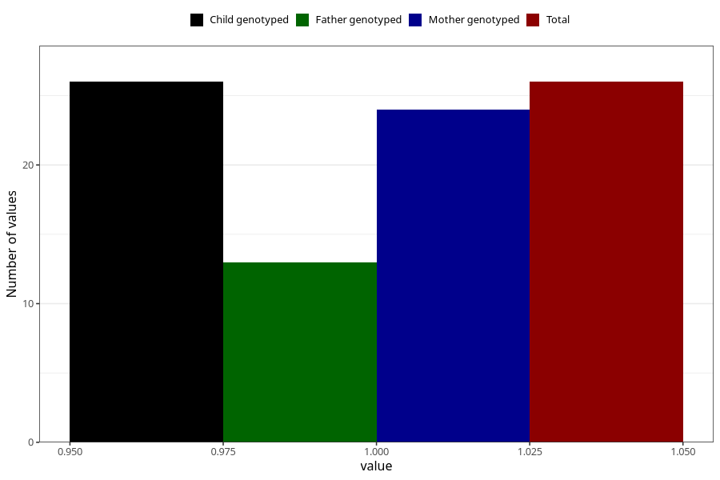

# amphetamine_during
Variable mapping to `AA1439` in `Skjema1_v12`.
- Number of values:

| Value | Total | Child genotyped | Mother genotyped | Father genotyped |
| ----- | ----- | --------------- | ---------------- | ---------------- |
| Missing | 75282 | 75282 | 71626 | 50071 |
| Non-missing | 26 | 26 | 24 | 13 |
| 1 | 26 | 26 | 24 | 13 |

