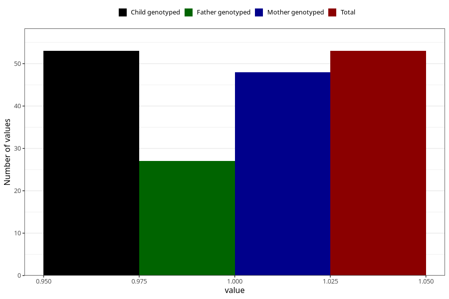

# cocaine_before
Variable mapping to `AA1446` in `Skjema1_v12`.
- Number of values:

| Value | Total | Child genotyped | Mother genotyped | Father genotyped |
| ----- | ----- | --------------- | ---------------- | ---------------- |
| Missing | 75255 | 75255 | 71602 | 50057 |
| Non-missing | 53 | 53 | 48 | 27 |
| 1 | 53 | 53 | 48 | 27 |

