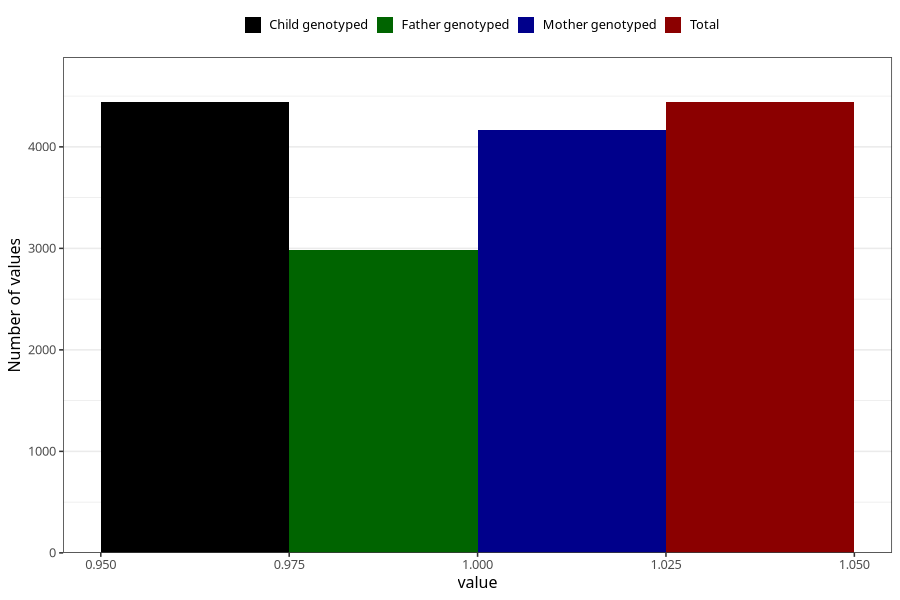

# depression_before
Variable mapping to `AA869` in `Skjema1_v12`.
- Number of values:

| Value | Total | Child genotyped | Mother genotyped | Father genotyped |
| ----- | ----- | --------------- | ---------------- | ---------------- |
| Missing | 70868 | 70868 | 67482 | 47103 |
| Non-missing | 4440 | 4440 | 4168 | 2981 |
| 1 | 4440 | 4440 | 4168 | 2981 |

