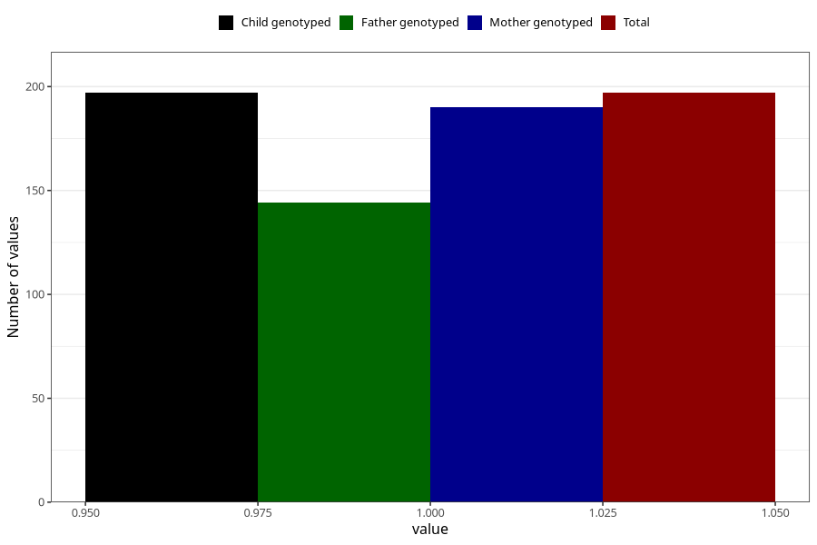

# diabetes_insulin_during
Variable mapping to `AA510` in `Skjema1_v12`.
- Number of values:

| Value | Total | Child genotyped | Mother genotyped | Father genotyped |
| ----- | ----- | --------------- | ---------------- | ---------------- |
| Missing | 75111 | 75111 | 71460 | 49940 |
| Non-missing | 197 | 197 | 190 | 144 |
| 1 | 197 | 197 | 190 | 144 |

