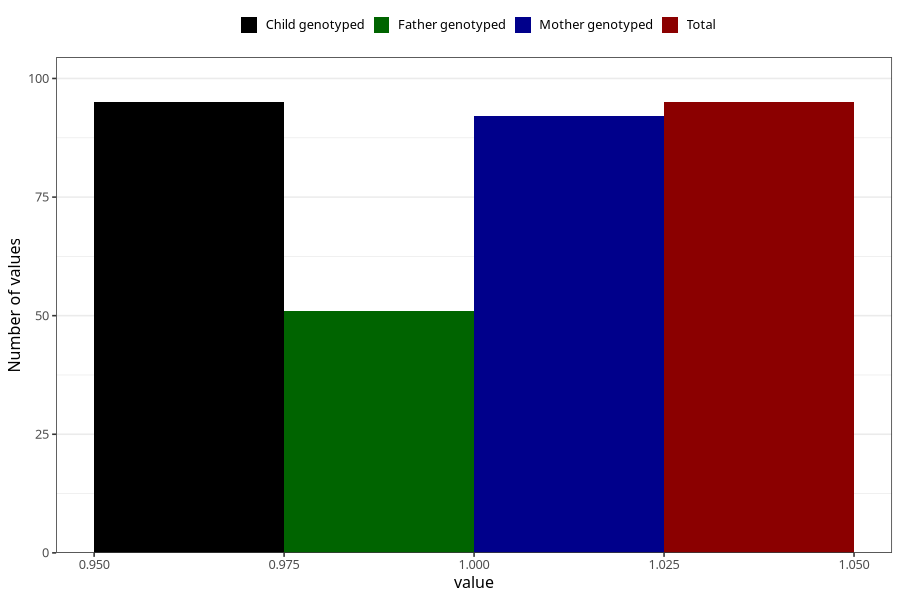

# diabetes_no_insuling_during
Variable mapping to `AA519` in `Skjema1_v12`.
- Number of values:

| Value | Total | Child genotyped | Mother genotyped | Father genotyped |
| ----- | ----- | --------------- | ---------------- | ---------------- |
| Missing | 75213 | 75213 | 71558 | 50033 |
| Non-missing | 95 | 95 | 92 | 51 |
| 1 | 95 | 95 | 92 | 51 |

