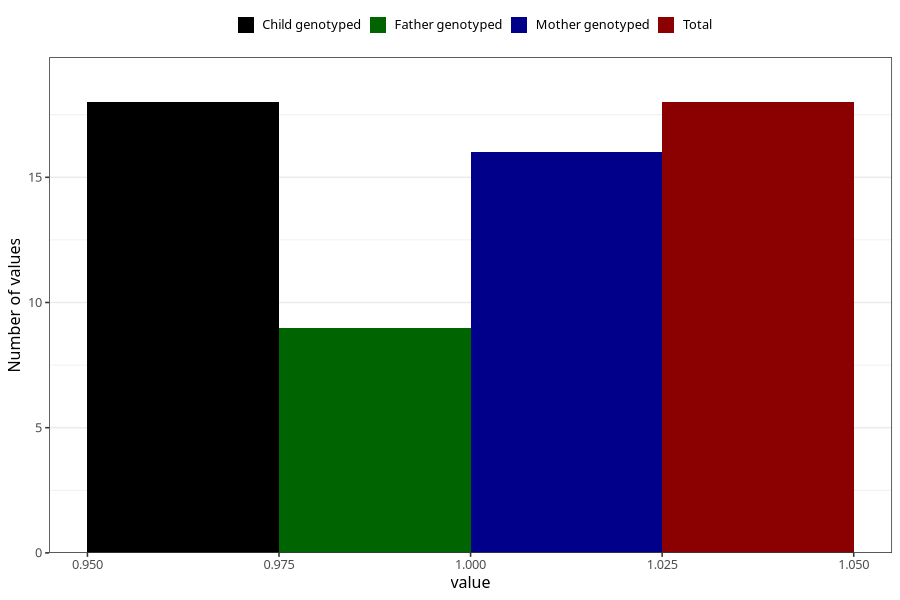

# ecstasy_before
Variable mapping to `AA1442` in `Skjema1_v12`.
- Number of values:

| Value | Total | Child genotyped | Mother genotyped | Father genotyped |
| ----- | ----- | --------------- | ---------------- | ---------------- |
| Missing | 75290 | 75290 | 71634 | 50075 |
| Non-missing | 18 | 18 | 16 | 9 |
| 1 | 18 | 18 | 16 | 9 |

