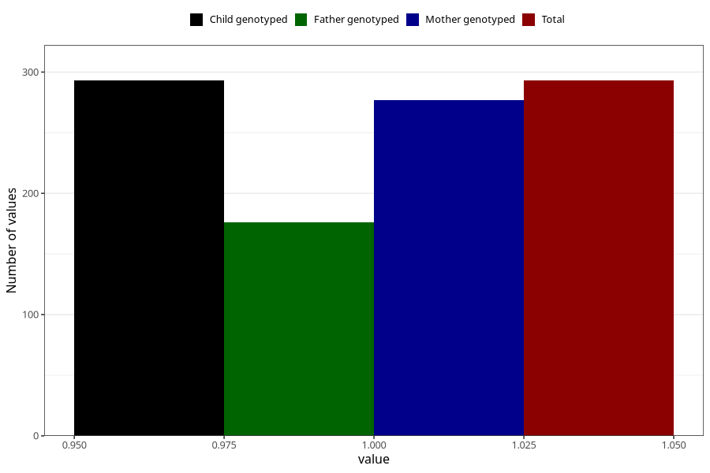

# hash_before
Variable mapping to `AA1434` in `Skjema1_v12`.
- Number of values:

| Value | Total | Child genotyped | Mother genotyped | Father genotyped |
| ----- | ----- | --------------- | ---------------- | ---------------- |
| Missing | 75015 | 75015 | 71373 | 49908 |
| Non-missing | 293 | 293 | 277 | 176 |
| 1 | 293 | 293 | 277 | 176 |

