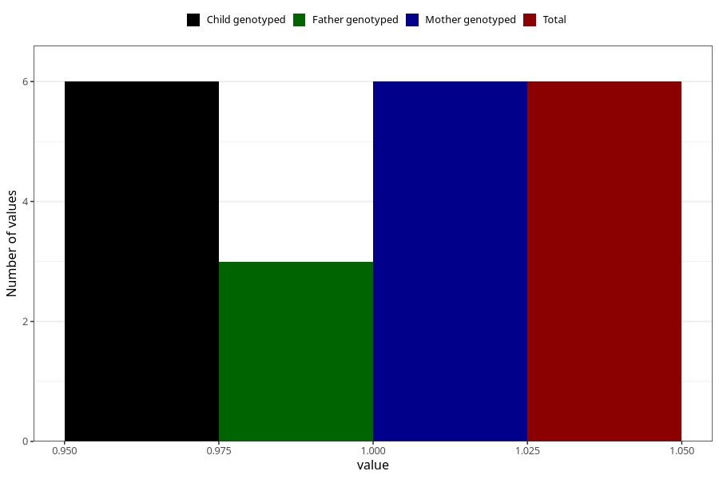

# heroin_before
Variable mapping to `AA1450` in `Skjema1_v12`.
- Number of values:

| Value | Total | Child genotyped | Mother genotyped | Father genotyped |
| ----- | ----- | --------------- | ---------------- | ---------------- |
| Missing | 75302 | 75302 | 71644 | 50081 |
| Non-missing | 6 | 6 | 6 | 3 |
| 1 | 6 | 6 | 6 | 3 |

