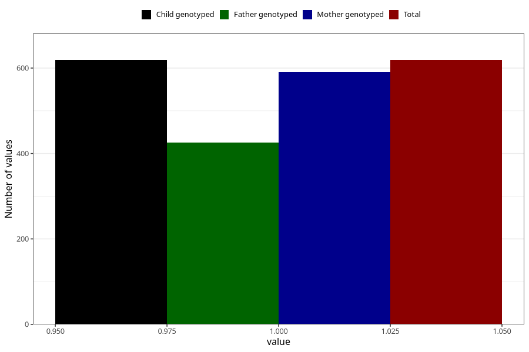

# high_cholesterol_before
Variable mapping to `AA545` in `Skjema1_v12`.
- Number of values:

| Value | Total | Child genotyped | Mother genotyped | Father genotyped |
| ----- | ----- | --------------- | ---------------- | ---------------- |
| Missing | 74689 | 74689 | 71059 | 49658 |
| Non-missing | 619 | 619 | 591 | 426 |
| 1 | 619 | 619 | 591 | 426 |

