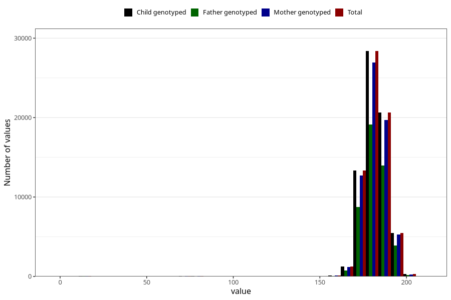

# father_height_15w
Variable mapping to `AA88` in `Skjema1_v12`.
- Number of values:

| Value | Total | Child genotyped | Mother genotyped | Father genotyped |
| ----- | ----- | --------------- | ---------------- | ---------------- |
| Missing | 5645 | 5645 | 5357 | 3217 |
| Non-missing | 69663 | 69663 | 66293 | 46867 |
| 25th percentile | 178 | 178 | 178 | 178 |
| 50th percentile | 182 | 182 | 182 | 182 |
| 75th percentile | 186 | 186 | 186 | 186 |
| Mean | 181.417452593199 | 181.417452593199 | 181.43512889747 | 181.565515181258 |
| Standard deviation | 9.53883450959593 | 9.53883450959593 | 9.4879271051576 | 9.29546439829532 |
| N | 69663 | 69663 | 66293 | 46867 |

