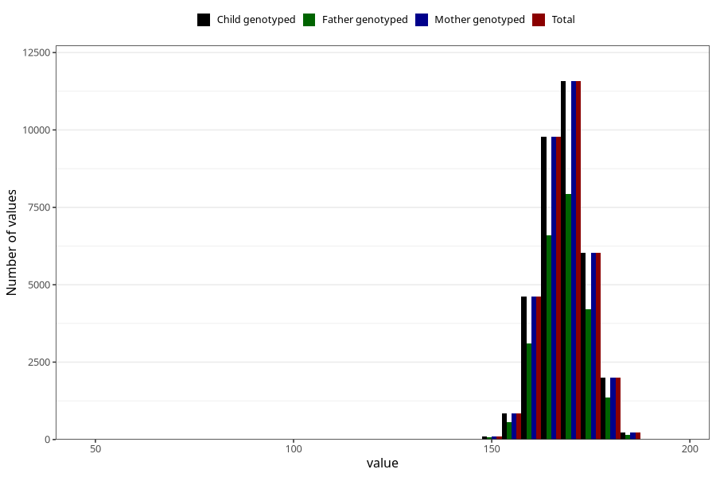

# height_hm
Variable mapping to `HM259` in `HelseModre`.
- Number of values:

| Value | Total | Child genotyped | Mother genotyped | Father genotyped |
| ----- | ----- | --------------- | ---------------- | ---------------- |
| Missing | 40105 | 40105 | 36447 | 26057 |
| Non-missing | 35203 | 35203 | 35203 | 24027 |
| 25th percentile | 164 | 164 | 164 | 164 |
| 50th percentile | 168 | 168 | 168 | 168 |
| 75th percentile | 172 | 172 | 172 | 172 |
| Mean | 168.245490441156 | 168.245490441156 | 168.245490441156 | 168.327506555125 |
| Standard deviation | 6.15030214329545 | 6.15030214329545 | 6.15030214329545 | 6.0608263219266 |
| N | 35203 | 35203 | 35203 | 24027 |

