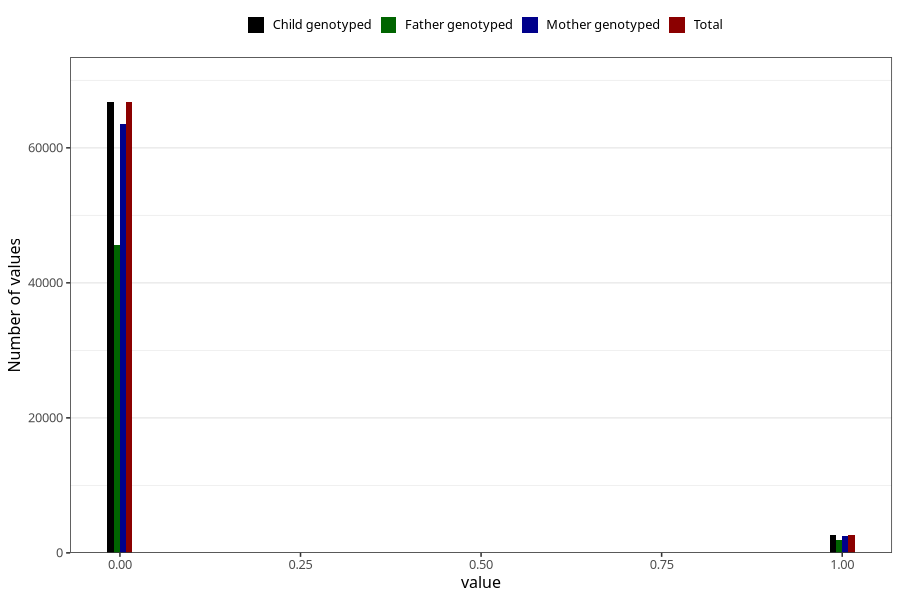

# mother_tongue_mother
Variable mapping to `AA1306_D` in `Skjema1_v12`.
- Number of values:

| Value | Total | Child genotyped | Mother genotyped | Father genotyped |
| ----- | ----- | --------------- | ---------------- | ---------------- |
| Missing | 5864 | 5864 | 5604 | 2623 |
| Non-missing | 69444 | 69444 | 66046 | 47461 |
| 0 | 66761 | 66761 | 63492 | 45603 |
| 1 | 2683 | 2683 | 2554 | 1858 |

