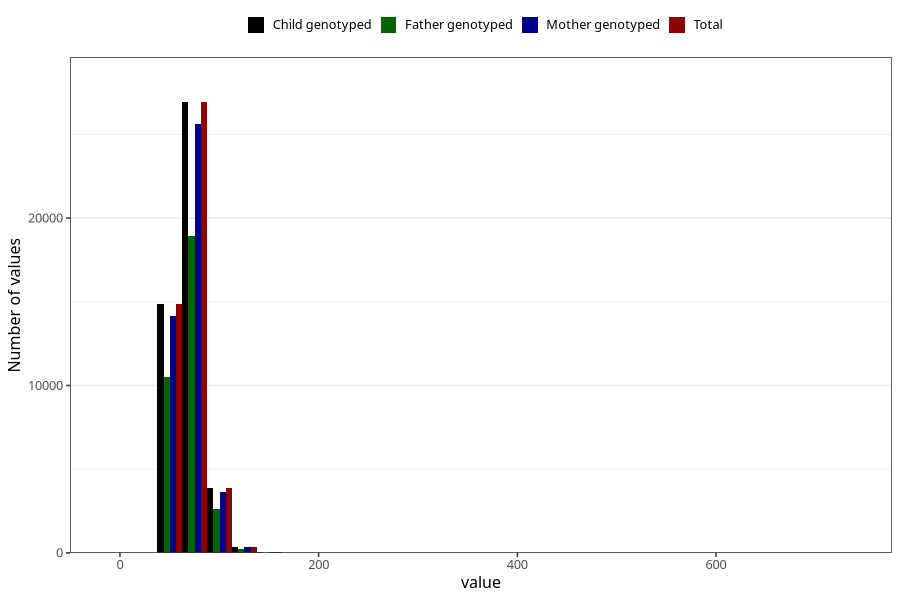

# mother_weight_18m
Variable mapping to `EE924` in `Skjema5_18mnd_v12`.
- Number of values:

| Value | Total | Child genotyped | Mother genotyped | Father genotyped |
| ----- | ----- | --------------- | ---------------- | ---------------- |
| Missing | 29225 | 29225 | 27865 | 17758 |
| Non-missing | 46083 | 46083 | 43785 | 32326 |
| 25th percentile | 60 | 60 | 60 | 60 |
| 50th percentile | 67 | 67 | 67 | 67 |
| 75th percentile | 76 | 76 | 76 | 76 |
| Mean | 69.5601783738038 | 69.5601783738038 | 69.5473358456092 | 69.4602363422632 |
| Standard deviation | 13.3852899486218 | 13.3852899486218 | 13.4007839236744 | 12.9057861179523 |
| N | 46083 | 46083 | 43785 | 32326 |

