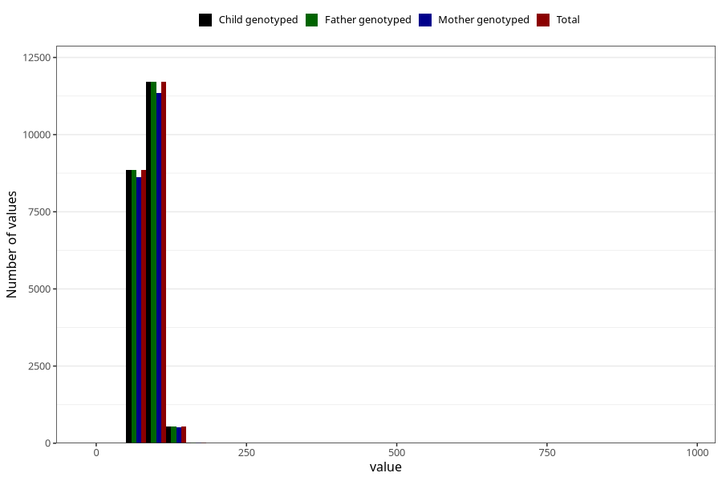

# weight_father15
Variable mapping to `G__6` in `Far2_V12`.
- Number of values:

| Value | Total | Child genotyped | Mother genotyped | Father genotyped |
| ----- | ----- | --------------- | ---------------- | ---------------- |
| Missing | 54189 | 54189 | 51152 | 28965 |
| Non-missing | 21119 | 21119 | 20498 | 21119 |
| 25th percentile | 79 | 79 | 79 | 79 |
| 50th percentile | 85 | 85 | 85 | 85 |
| 75th percentile | 95 | 95 | 95 | 95 |
| Mean | 87.3853875656991 | 87.3853875656991 | 87.3565225875695 | 87.3853875656991 |
| Standard deviation | 14.18747063014 | 14.18747063014 | 14.1790083002478 | 14.18747063014 |
| N | 21119 | 21119 | 20498 | 21119 |

