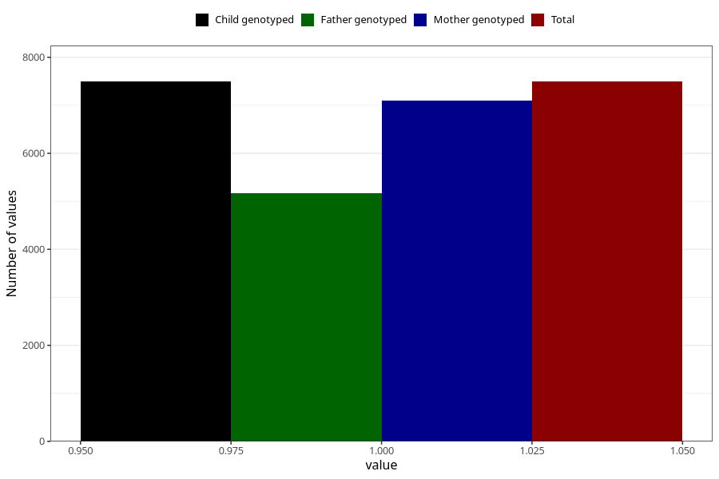

# abdominal_pain_9w_12w
Variable mapping to `AA188` in `Skjema1_v12`.
- Number of values:

| Value | Total | Child genotyped | Mother genotyped | Father genotyped |
| ----- | ----- | --------------- | ---------------- | ---------------- |
| Missing | 67814 | 67814 | 64546 | 44923 |
| Non-missing | 7494 | 7494 | 7104 | 5161 |
| 1 | 7494 | 7494 | 7104 | 5161 |

