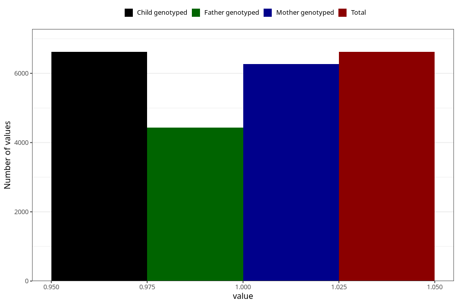

# back_pain_13w_16w
Variable mapping to `CC352` in `Skjema3_v12`.
- Number of values:

| Value | Total | Child genotyped | Mother genotyped | Father genotyped |
| ----- | ----- | --------------- | ---------------- | ---------------- |
| Missing | 68690 | 68690 | 65377 | 45655 |
| Non-missing | 6618 | 6618 | 6273 | 4429 |
| 1 | 6618 | 6618 | 6273 | 4429 |

