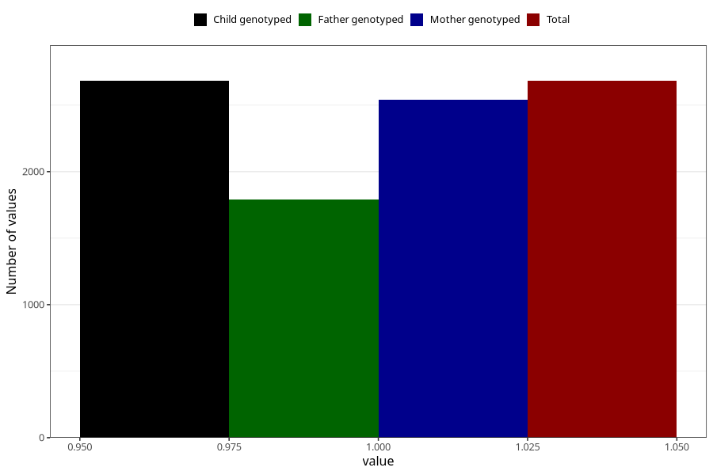

# back_pain_before_4w
Variable mapping to `AA196` in `Skjema1_v12`.
- Number of values:

| Value | Total | Child genotyped | Mother genotyped | Father genotyped |
| ----- | ----- | --------------- | ---------------- | ---------------- |
| Missing | 72626 | 72626 | 69111 | 48295 |
| Non-missing | 2682 | 2682 | 2539 | 1789 |
| 1 | 2682 | 2682 | 2539 | 1789 |

