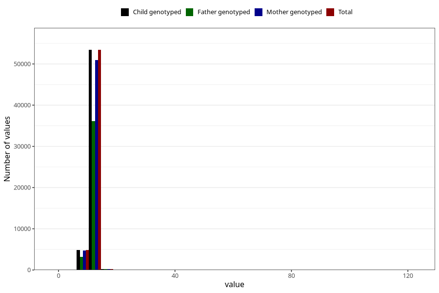

# blood_haemoglobin_last_check_30w
Variable mapping to `CC124` in `Skjema3_v12`.
- Number of values:

| Value | Total | Child genotyped | Mother genotyped | Father genotyped |
| ----- | ----- | --------------- | ---------------- | ---------------- |
| Missing | 16595 | 16595 | 15675 | 10451 |
| Non-missing | 58713 | 58713 | 55975 | 39633 |
| 25th percentile | 11.2 | 11.2 | 11.2 | 11.2 |
| 50th percentile | 11.8 | 11.8 | 11.8 | 11.9 |
| 75th percentile | 12.5 | 12.5 | 12.5 | 12.5 |
| Mean | 11.9375351285065 | 11.9375351285065 | 11.9391710585083 | 11.939315721747 |
| Standard deviation | 2.59981571743273 | 2.59981571743273 | 2.63715110167397 | 2.37529016905762 |
| N | 58713 | 58713 | 55975 | 39633 |

