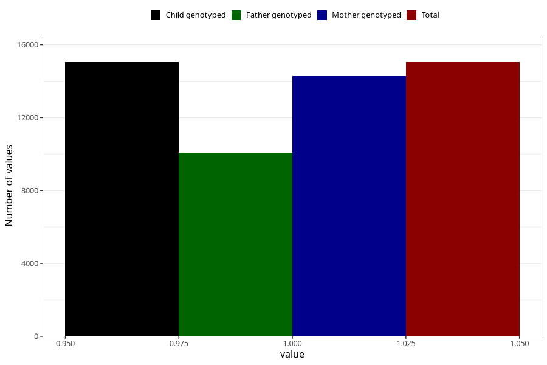

# constipation_13w_15w
Variable mapping to `AA269` in `Skjema1_v12`.
- Number of values:

| Value | Total | Child genotyped | Mother genotyped | Father genotyped |
| ----- | ----- | --------------- | ---------------- | ---------------- |
| Missing | 60265 | 60265 | 57375 | 39992 |
| Non-missing | 15043 | 15043 | 14275 | 10092 |
| 1 | 15043 | 15043 | 14275 | 10092 |

