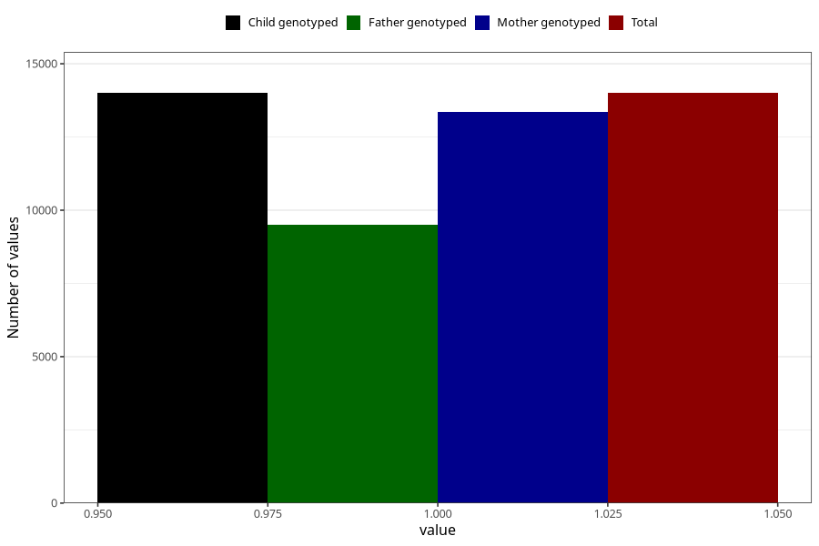

# constipation_25w_28w
Variable mapping to `CC439` in `Skjema3_v12`.
- Number of values:

| Value | Total | Child genotyped | Mother genotyped | Father genotyped |
| ----- | ----- | --------------- | ---------------- | ---------------- |
| Missing | 61306 | 61306 | 58307 | 40593 |
| Non-missing | 14002 | 14002 | 13343 | 9491 |
| 1 | 14002 | 14002 | 13343 | 9491 |

