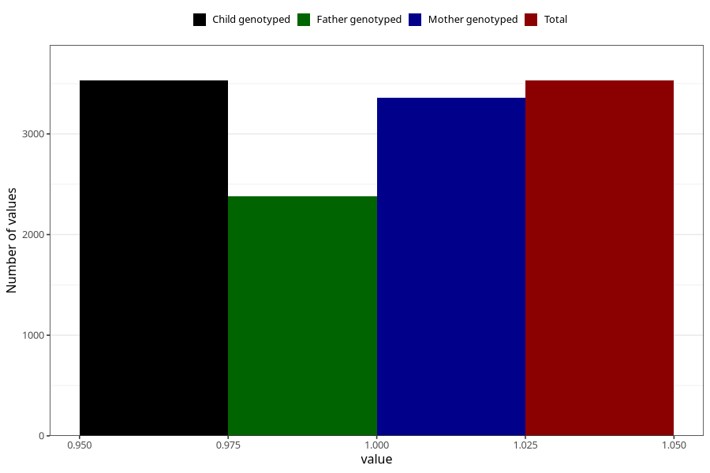

# diarrhoea_13w_15w
Variable mapping to `AA279` in `Skjema1_v12`.
- Number of values:

| Value | Total | Child genotyped | Mother genotyped | Father genotyped |
| ----- | ----- | --------------- | ---------------- | ---------------- |
| Missing | 71778 | 71778 | 68293 | 47704 |
| Non-missing | 3530 | 3530 | 3357 | 2380 |
| 1 | 3530 | 3530 | 3357 | 2380 |

