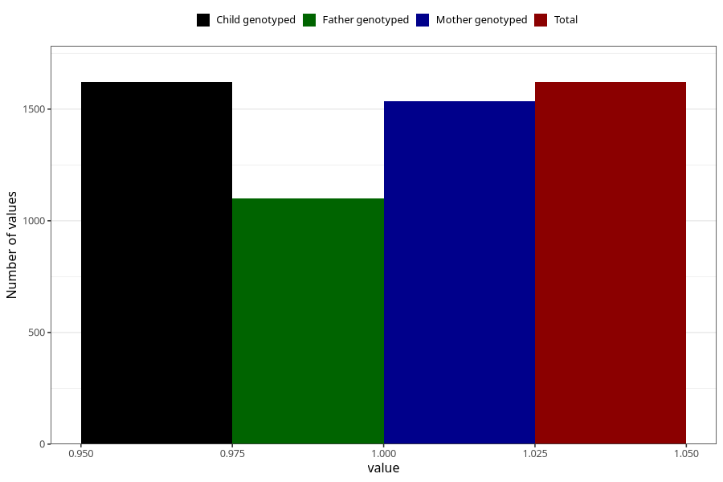

# diarrhoea_17w_20w
Variable mapping to `CC449` in `Skjema3_v12`.
- Number of values:

| Value | Total | Child genotyped | Mother genotyped | Father genotyped |
| ----- | ----- | --------------- | ---------------- | ---------------- |
| Missing | 73687 | 73687 | 70114 | 48985 |
| Non-missing | 1621 | 1621 | 1536 | 1099 |
| 1 | 1621 | 1621 | 1536 | 1099 |

