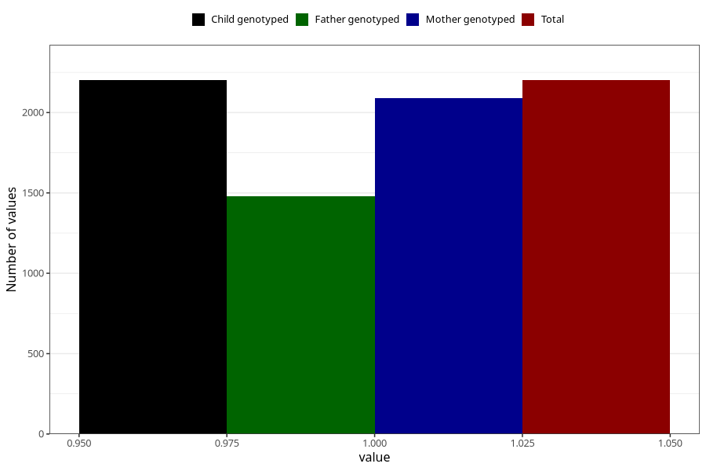

# diarrhoea_21w_24w
Variable mapping to `CC450` in `Skjema3_v12`.
- Number of values:

| Value | Total | Child genotyped | Mother genotyped | Father genotyped |
| ----- | ----- | --------------- | ---------------- | ---------------- |
| Missing | 73107 | 73107 | 69560 | 48607 |
| Non-missing | 2201 | 2201 | 2090 | 1477 |
| 1 | 2201 | 2201 | 2090 | 1477 |

