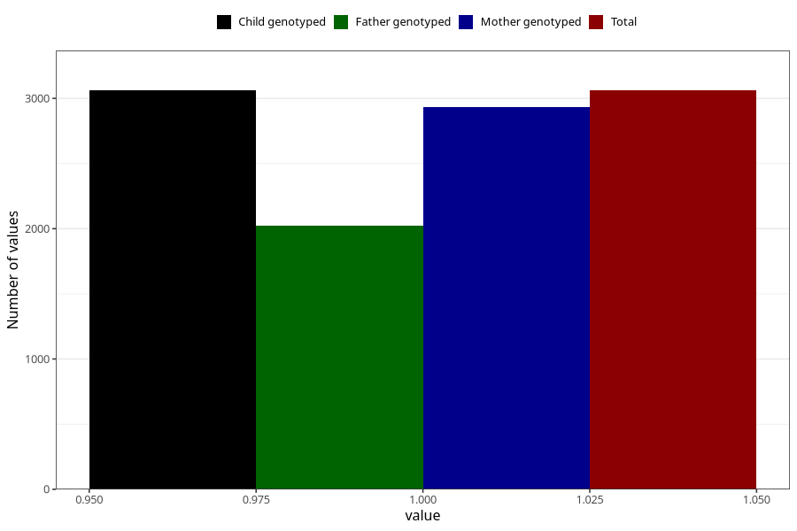

# diarrhoea_25w_28w
Variable mapping to `CC451` in `Skjema3_v12`.
- Number of values:

| Value | Total | Child genotyped | Mother genotyped | Father genotyped |
| ----- | ----- | --------------- | ---------------- | ---------------- |
| Missing | 72247 | 72247 | 68714 | 48064 |
| Non-missing | 3061 | 3061 | 2936 | 2020 |
| 1 | 3061 | 3061 | 2936 | 2020 |

