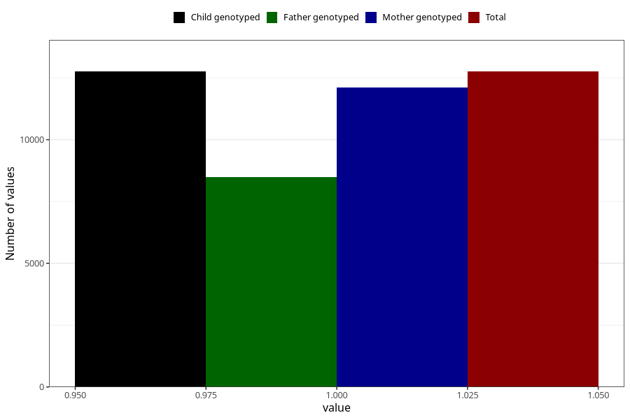

# heartburn_13w_15w
Variable mapping to `AA309` in `Skjema1_v12`.
- Number of values:

| Value | Total | Child genotyped | Mother genotyped | Father genotyped |
| ----- | ----- | --------------- | ---------------- | ---------------- |
| Missing | 62552 | 62552 | 59536 | 41607 |
| Non-missing | 12756 | 12756 | 12114 | 8477 |
| 1 | 12756 | 12756 | 12114 | 8477 |

