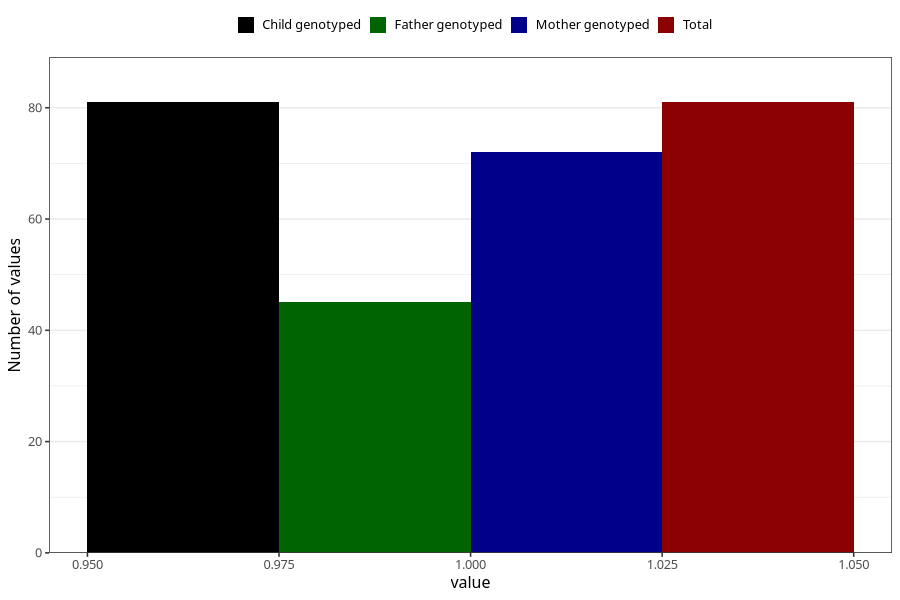

# hospitalized_bleeding_21_24w
Variable mapping to `CC152` in `Skjema3_v12`.
- Number of values:

| Value | Total | Child genotyped | Mother genotyped | Father genotyped |
| ----- | ----- | --------------- | ---------------- | ---------------- |
| Missing | 75227 | 75227 | 71578 | 50039 |
| Non-missing | 81 | 81 | 72 | 45 |
| 1 | 81 | 81 | 72 | 45 |

