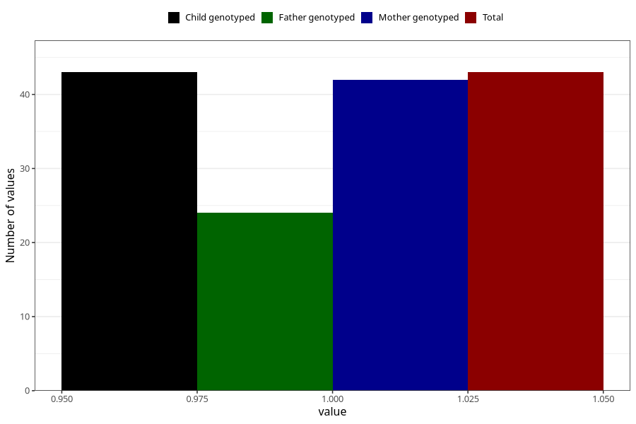

# hospitalized_high_blood_pressure_after_29w
Variable mapping to `CC181` in `Skjema3_v12`.
- Number of values:

| Value | Total | Child genotyped | Mother genotyped | Father genotyped |
| ----- | ----- | --------------- | ---------------- | ---------------- |
| Missing | 75265 | 75265 | 71608 | 50060 |
| Non-missing | 43 | 43 | 42 | 24 |
| 1 | 43 | 43 | 42 | 24 |

