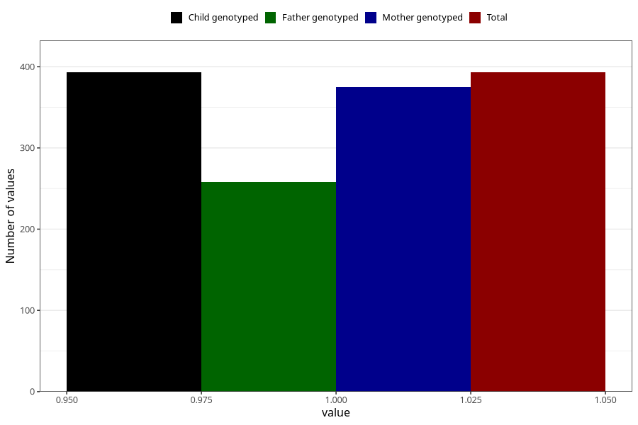

# hospitalized_other_21_24w
Variable mapping to `CC197` in `Skjema3_v12`.
- Number of values:

| Value | Total | Child genotyped | Mother genotyped | Father genotyped |
| ----- | ----- | --------------- | ---------------- | ---------------- |
| Missing | 74915 | 74915 | 71275 | 49826 |
| Non-missing | 393 | 393 | 375 | 258 |
| 1 | 393 | 393 | 375 | 258 |

