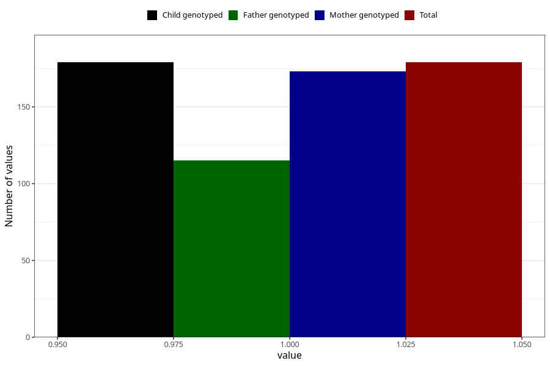

# hospitalized_other_5_8w
Variable mapping to `CC193` in `Skjema3_v12`.
- Number of values:

| Value | Total | Child genotyped | Mother genotyped | Father genotyped |
| ----- | ----- | --------------- | ---------------- | ---------------- |
| Missing | 75129 | 75129 | 71477 | 49969 |
| Non-missing | 179 | 179 | 173 | 115 |
| 1 | 179 | 179 | 173 | 115 |

