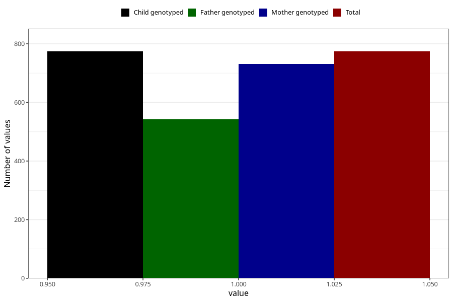

# hospitalized_prolonged_nausea_vomiting
Variable mapping to `CC137` in `Skjema3_v12`.
- Number of values:

| Value | Total | Child genotyped | Mother genotyped | Father genotyped |
| ----- | ----- | --------------- | ---------------- | ---------------- |
| Missing | 74534 | 74534 | 70918 | 49541 |
| Non-missing | 774 | 774 | 732 | 543 |
| 1 | 774 | 774 | 732 | 543 |

