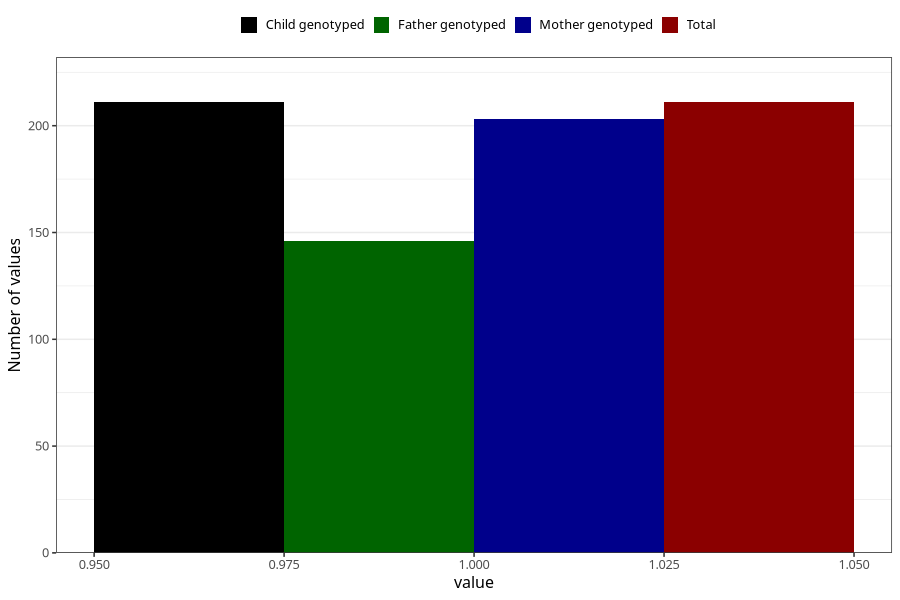

# hospitalized_prolonged_nausea_vomiting_13_16w
Variable mapping to `CC141` in `Skjema3_v12`.
- Number of values:

| Value | Total | Child genotyped | Mother genotyped | Father genotyped |
| ----- | ----- | --------------- | ---------------- | ---------------- |
| Missing | 75097 | 75097 | 71447 | 49938 |
| Non-missing | 211 | 211 | 203 | 146 |
| 1 | 211 | 211 | 203 | 146 |

