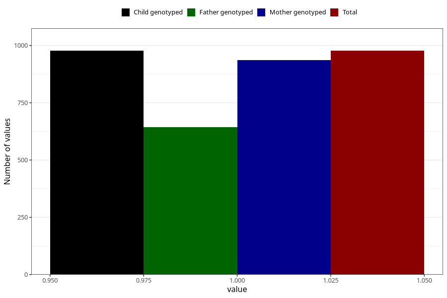

# influenza_5w_8w
Variable mapping to `AA377` in `Skjema1_v12`.
- Number of values:

| Value | Total | Child genotyped | Mother genotyped | Father genotyped |
| ----- | ----- | --------------- | ---------------- | ---------------- |
| Missing | 74331 | 74331 | 70713 | 49440 |
| Non-missing | 977 | 977 | 937 | 644 |
| 1 | 977 | 977 | 937 | 644 |

