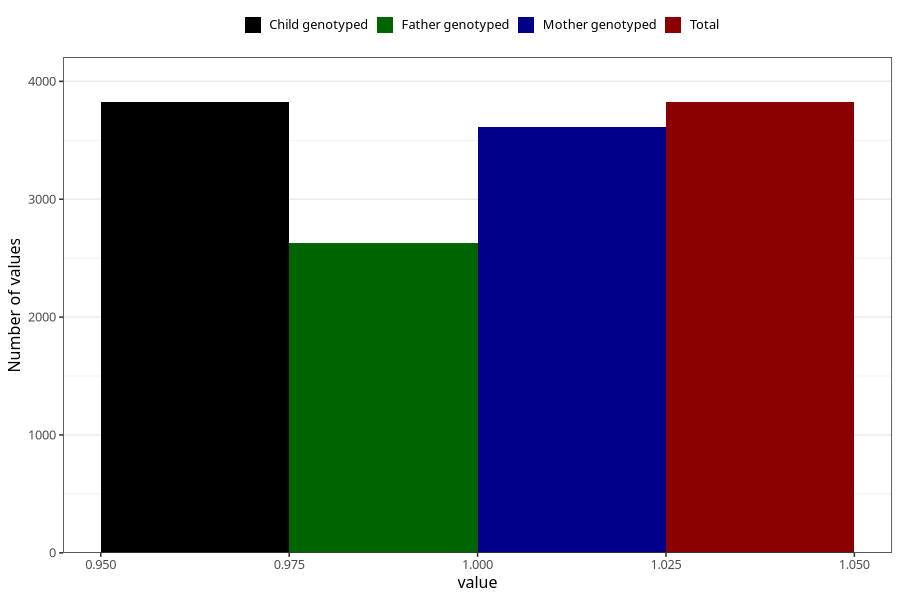

# long_term_nausea_vomiting_17w_20w
Variable mapping to `CC389` in `Skjema3_v12`.
- Number of values:

| Value | Total | Child genotyped | Mother genotyped | Father genotyped |
| ----- | ----- | --------------- | ---------------- | ---------------- |
| Missing | 71485 | 71485 | 68036 | 47452 |
| Non-missing | 3823 | 3823 | 3614 | 2632 |
| 1 | 3823 | 3823 | 3614 | 2632 |

