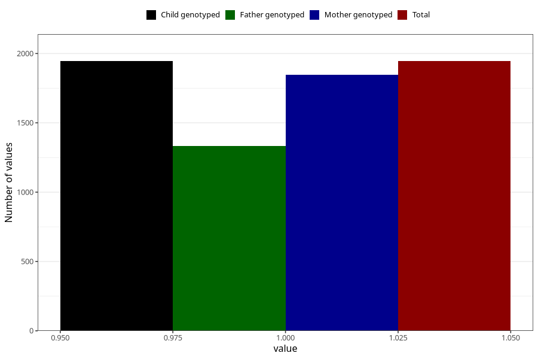

# long_term_nausea_vomiting_21w_24w
Variable mapping to `CC390` in `Skjema3_v12`.
- Number of values:

| Value | Total | Child genotyped | Mother genotyped | Father genotyped |
| ----- | ----- | --------------- | ---------------- | ---------------- |
| Missing | 73363 | 73363 | 69805 | 48751 |
| Non-missing | 1945 | 1945 | 1845 | 1333 |
| 1 | 1945 | 1945 | 1845 | 1333 |

