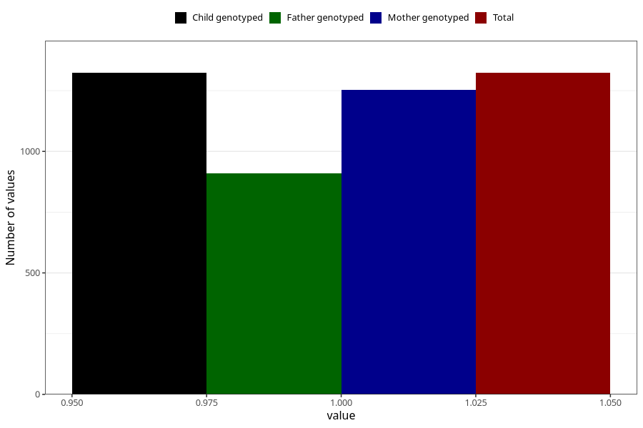

# long_term_nausea_vomiting_25w_28w
Variable mapping to `CC391` in `Skjema3_v12`.
- Number of values:

| Value | Total | Child genotyped | Mother genotyped | Father genotyped |
| ----- | ----- | --------------- | ---------------- | ---------------- |
| Missing | 73985 | 73985 | 70396 | 49173 |
| Non-missing | 1323 | 1323 | 1254 | 911 |
| 1 | 1323 | 1323 | 1254 | 911 |

