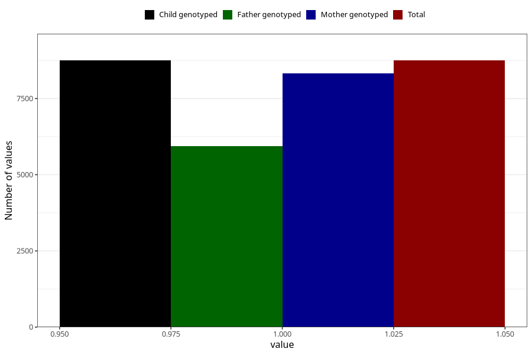

# nausea_17w_20w
Variable mapping to `CC377` in `Skjema3_v12`.
- Number of values:

| Value | Total | Child genotyped | Mother genotyped | Father genotyped |
| ----- | ----- | --------------- | ---------------- | ---------------- |
| Missing | 66559 | 66559 | 63327 | 44141 |
| Non-missing | 8749 | 8749 | 8323 | 5943 |
| 1 | 8749 | 8749 | 8323 | 5943 |

