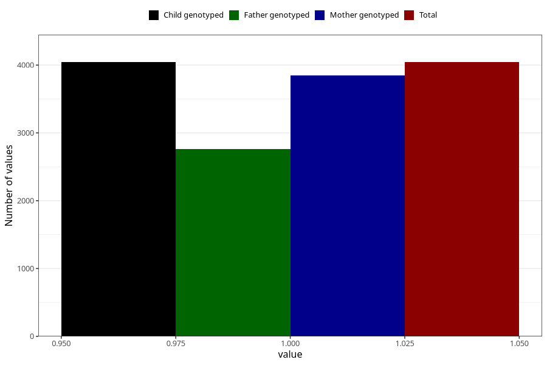

# nausea_after_29w
Variable mapping to `CC380` in `Skjema3_v12`.
- Number of values:

| Value | Total | Child genotyped | Mother genotyped | Father genotyped |
| ----- | ----- | --------------- | ---------------- | ---------------- |
| Missing | 71265 | 71265 | 67804 | 47322 |
| Non-missing | 4043 | 4043 | 3846 | 2762 |
| 1 | 4043 | 4043 | 3846 | 2762 |

