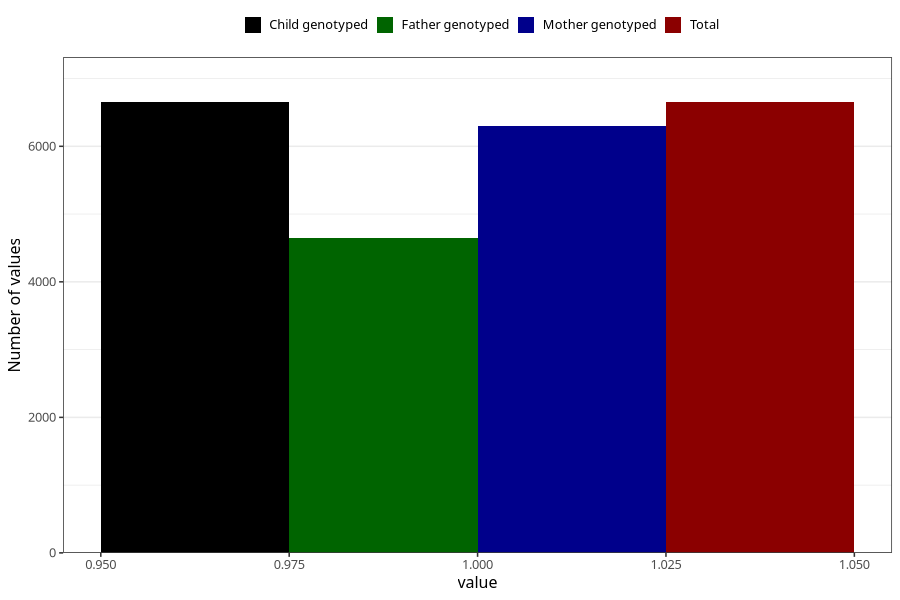

# nausea_week_most_bothered_still_q2
Variable mapping to `BB855` in `Skjema2CDW_v12`.
- Number of values:

| Value | Total | Child genotyped | Mother genotyped | Father genotyped |
| ----- | ----- | --------------- | ---------------- | ---------------- |
| Missing | 68657 | 68657 | 65348 | 45442 |
| Non-missing | 6651 | 6651 | 6302 | 4642 |
| 1 | 6651 | 6651 | 6302 | 4642 |

