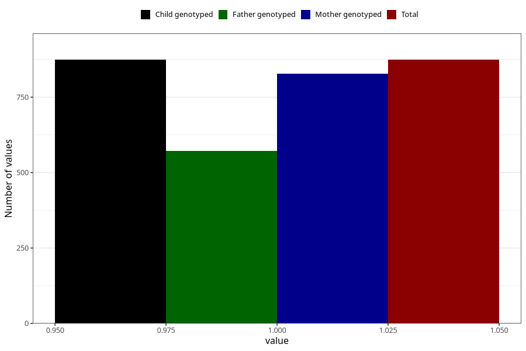

# oedema_9w_12w
Variable mapping to `AA318` in `Skjema1_v12`.
- Number of values:

| Value | Total | Child genotyped | Mother genotyped | Father genotyped |
| ----- | ----- | --------------- | ---------------- | ---------------- |
| Missing | 74434 | 74434 | 70822 | 49512 |
| Non-missing | 874 | 874 | 828 | 572 |
| 1 | 874 | 874 | 828 | 572 |

