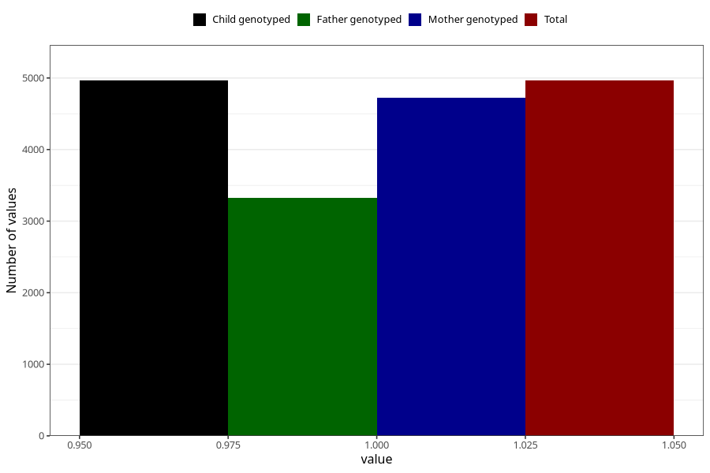

# other_muscle_joint_pain_21w_24w
Variable mapping to `CC366` in `Skjema3_v12`.
- Number of values:

| Value | Total | Child genotyped | Mother genotyped | Father genotyped |
| ----- | ----- | --------------- | ---------------- | ---------------- |
| Missing | 70344 | 70344 | 66924 | 46755 |
| Non-missing | 4964 | 4964 | 4726 | 3329 |
| 1 | 4964 | 4964 | 4726 | 3329 |

