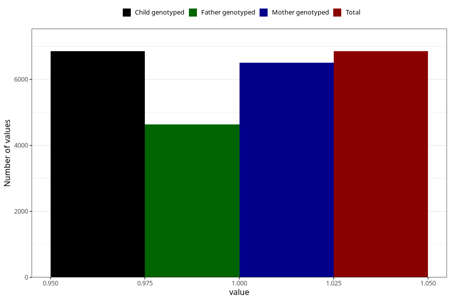

# other_muscle_joint_pain_after_29w
Variable mapping to `CC368` in `Skjema3_v12`.
- Number of values:

| Value | Total | Child genotyped | Mother genotyped | Father genotyped |
| ----- | ----- | --------------- | ---------------- | ---------------- |
| Missing | 68455 | 68455 | 65142 | 45444 |
| Non-missing | 6853 | 6853 | 6508 | 4640 |
| 1 | 6853 | 6853 | 6508 | 4640 |

