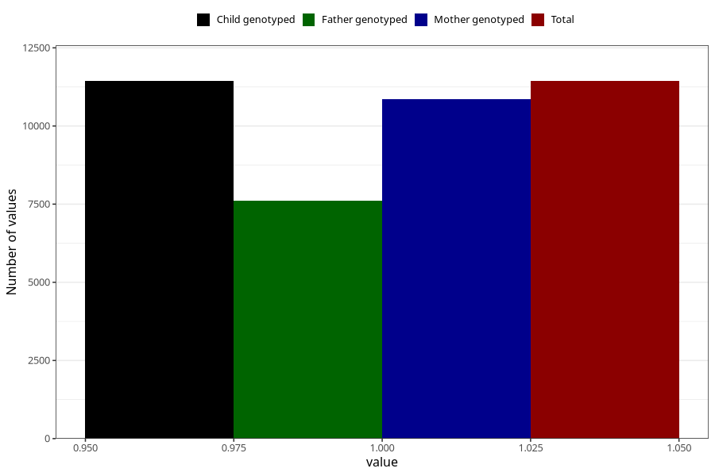

# pelvic_girdle_pain_17w_20w
Variable mapping to `CC341` in `Skjema3_v12`.
- Number of values:

| Value | Total | Child genotyped | Mother genotyped | Father genotyped |
| ----- | ----- | --------------- | ---------------- | ---------------- |
| Missing | 63871 | 63871 | 60788 | 42481 |
| Non-missing | 11437 | 11437 | 10862 | 7603 |
| 1 | 11437 | 11437 | 10862 | 7603 |

