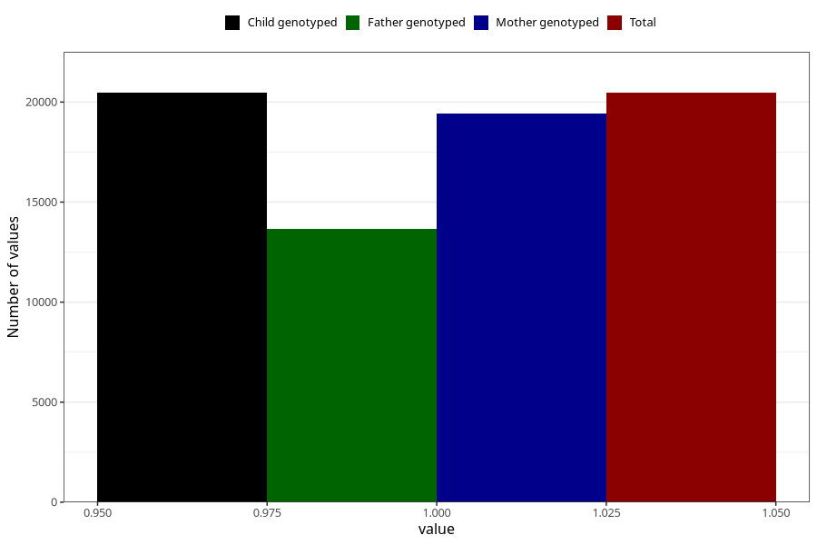

# pelvic_girdle_pain_25w_28w
Variable mapping to `CC343` in `Skjema3_v12`.
- Number of values:

| Value | Total | Child genotyped | Mother genotyped | Father genotyped |
| ----- | ----- | --------------- | ---------------- | ---------------- |
| Missing | 54847 | 54847 | 52203 | 36436 |
| Non-missing | 20461 | 20461 | 19447 | 13648 |
| 1 | 20461 | 20461 | 19447 | 13648 |

