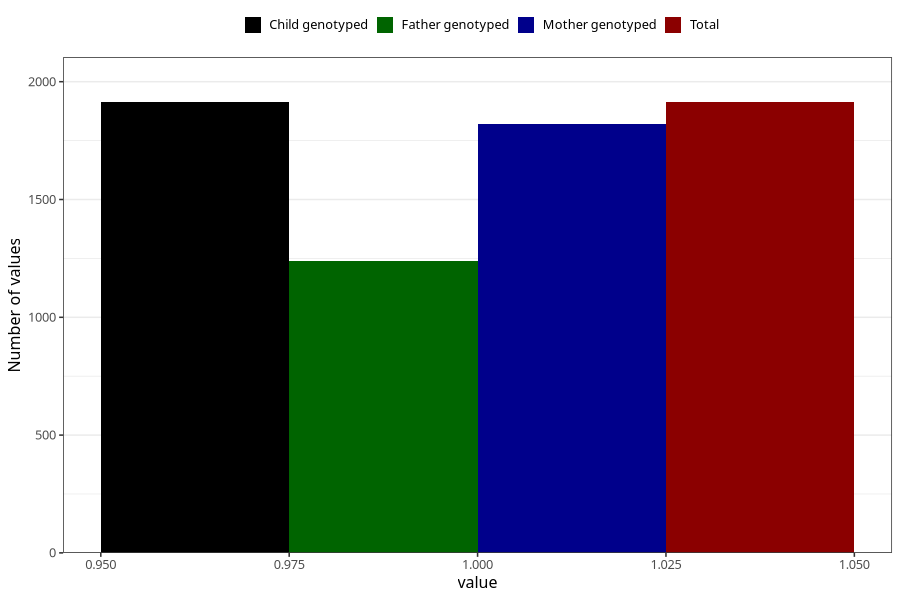

# pelvic_girdle_pain_5w_8w
Variable mapping to `AA177` in `Skjema1_v12`.
- Number of values:

| Value | Total | Child genotyped | Mother genotyped | Father genotyped |
| ----- | ----- | --------------- | ---------------- | ---------------- |
| Missing | 73395 | 73395 | 69830 | 48843 |
| Non-missing | 1913 | 1913 | 1820 | 1241 |
| 1 | 1913 | 1913 | 1820 | 1241 |

