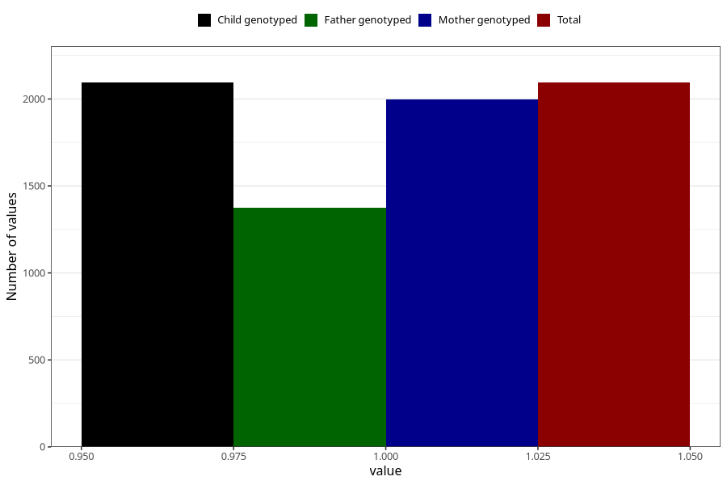

# pregnancy_itch_13w_16w
Variable mapping to `CC424` in `Skjema3_v12`.
- Number of values:

| Value | Total | Child genotyped | Mother genotyped | Father genotyped |
| ----- | ----- | --------------- | ---------------- | ---------------- |
| Missing | 73214 | 73214 | 69654 | 48710 |
| Non-missing | 2094 | 2094 | 1996 | 1374 |
| 1 | 2094 | 2094 | 1996 | 1374 |

