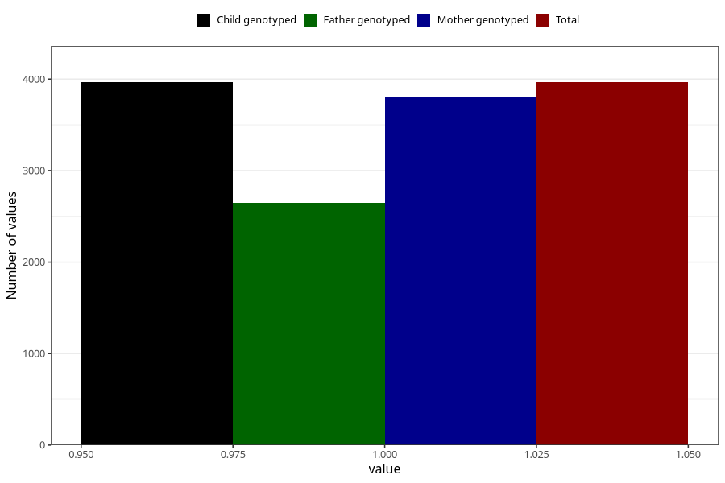

# pregnancy_itch_after_29w
Variable mapping to `CC428` in `Skjema3_v12`.
- Number of values:

| Value | Total | Child genotyped | Mother genotyped | Father genotyped |
| ----- | ----- | --------------- | ---------------- | ---------------- |
| Missing | 71343 | 71343 | 67847 | 47439 |
| Non-missing | 3965 | 3965 | 3803 | 2645 |
| 1 | 3965 | 3965 | 3803 | 2645 |

