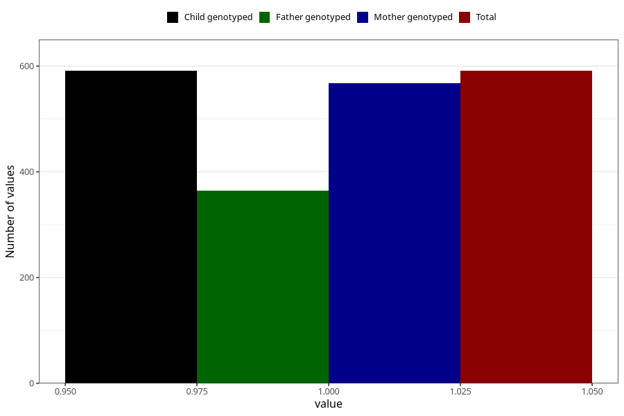

# pregnancy_itch_before_4w
Variable mapping to `AA256` in `Skjema1_v12`.
- Number of values:

| Value | Total | Child genotyped | Mother genotyped | Father genotyped |
| ----- | ----- | --------------- | ---------------- | ---------------- |
| Missing | 74717 | 74717 | 71082 | 49720 |
| Non-missing | 591 | 591 | 568 | 364 |
| 1 | 591 | 591 | 568 | 364 |

