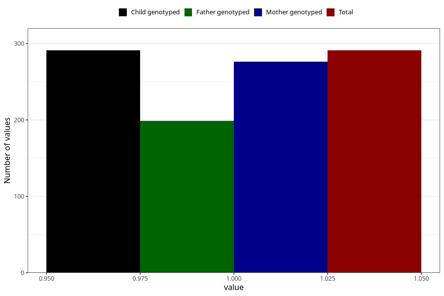

# protein_in_urine_before_4w
Variable mapping to `AA406` in `Skjema1_v12`.
- Number of values:

| Value | Total | Child genotyped | Mother genotyped | Father genotyped |
| ----- | ----- | --------------- | ---------------- | ---------------- |
| Missing | 75017 | 75017 | 71374 | 49885 |
| Non-missing | 291 | 291 | 276 | 199 |
| 1 | 291 | 291 | 276 | 199 |

