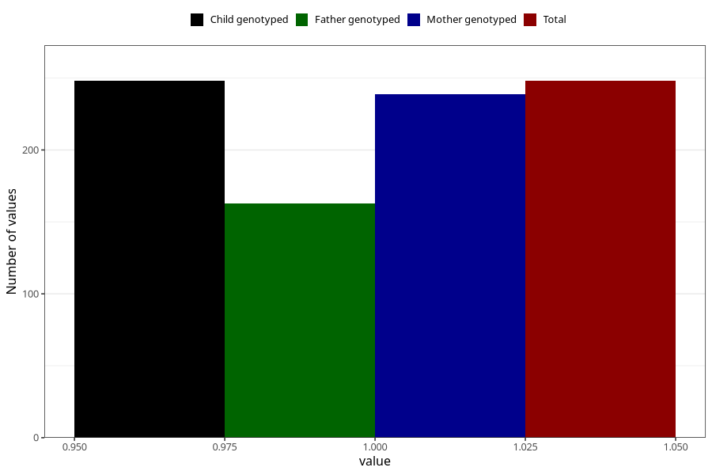

# sugar_in_urine_5w_8w
Variable mapping to `AA397` in `Skjema1_v12`.
- Number of values:

| Value | Total | Child genotyped | Mother genotyped | Father genotyped |
| ----- | ----- | --------------- | ---------------- | ---------------- |
| Missing | 75060 | 75060 | 71411 | 49921 |
| Non-missing | 248 | 248 | 239 | 163 |
| 1 | 248 | 248 | 239 | 163 |

