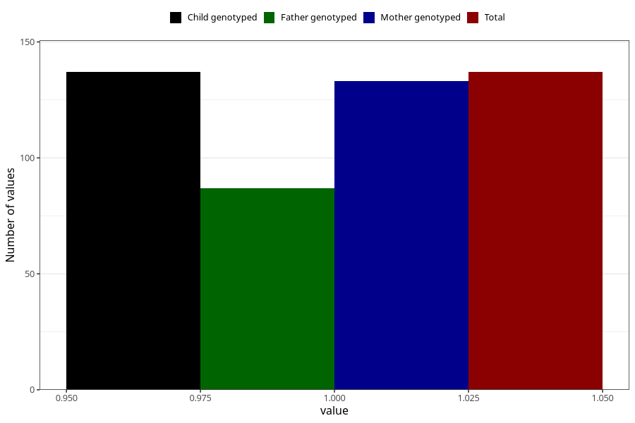

# sugar_in_urine_before_4w
Variable mapping to `AA396` in `Skjema1_v12`.
- Number of values:

| Value | Total | Child genotyped | Mother genotyped | Father genotyped |
| ----- | ----- | --------------- | ---------------- | ---------------- |
| Missing | 75171 | 75171 | 71517 | 49997 |
| Non-missing | 137 | 137 | 133 | 87 |
| 1 | 137 | 137 | 133 | 87 |

